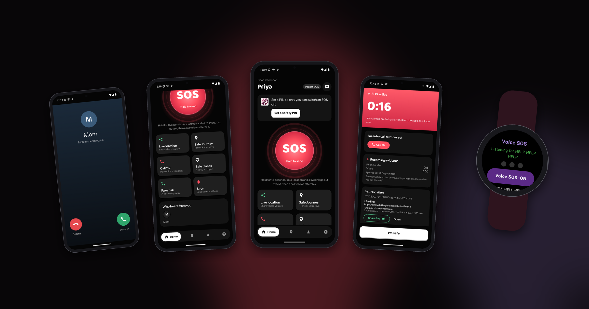
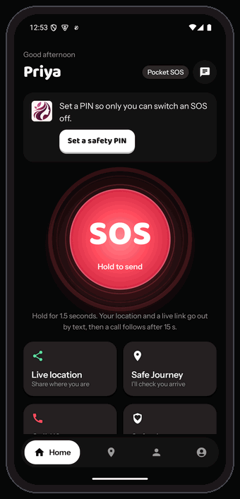
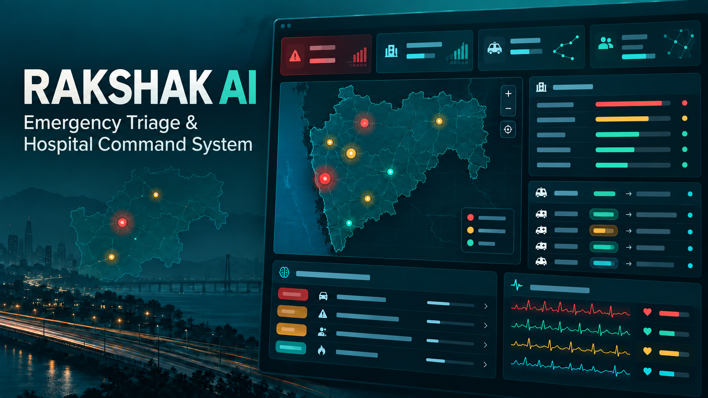
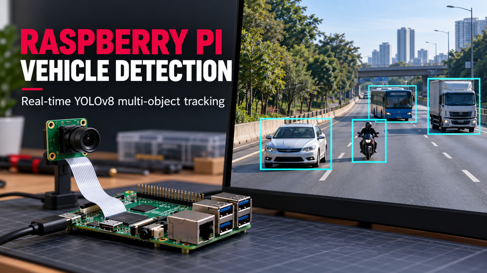
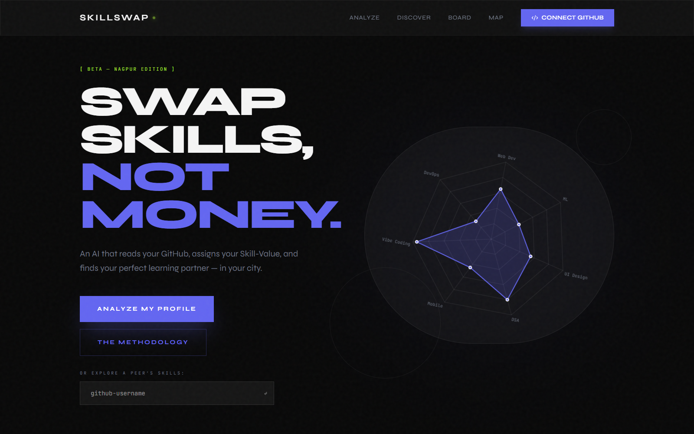

<div align="center">

<a href="https://git.io/typing-svg">
  
</a>

<br/><br/>


<br/><br/>

<a href="https://www.linkedin.com/in/mohit-hadap-56213139b/"></a>
<a href="mailto:mohit.hadap@gmail.com"></a>
<a href="https://github.com/mohithadap-dotcom"></a>

<br/><br/>


</div>

<br/>

---

## 🧠 About Me

I'm a **Computer Science Engineering student and software developer** based in Nagpur, India, focused on building full-stack **TypeScript/React** applications, **Python/FastAPI** backends, and **AI-enabled civic-tech tools**.

- 🏗️ I build production-style full-stack applications using **Next.js, React, Vite, FastAPI, and Express.js**
- 🤖 I work hands-on with **AI/ML** — Google Gemini-powered workflows, YOLOv8/OpenCV computer vision, and structured AI outputs for real-world detection and reporting systems
- 🗺️ I have a strong interest in **geospatial dashboards, civic-tech, and emergency-response platforms** that combine data, maps, and automation
- ⚙️ I design schemas and backends with **Supabase/PostgreSQL**, including Row-Level Security and normalized data models
- 🚀 I'm comfortable operating at **hackathon speed** — rapid prototyping, tight timelines, and cross-functional team collaboration
- 🔌 I also work with **IoT/embedded systems** (ESP32, Arduino, Raspberry Pi) for hardware-software integrated prototypes

```yaml
Open To:
  - Software Developer Roles (Full Stack / Backend)
  - AI / Computer Vision Engineering Internships & Roles
  - Civic-Tech & Product Engineering Collaborations
  - Hackathons & Open Source Contributions
  - Internship Opportunities
```

---

## 🛠️ Tech Stack

<div align="center">

**Languages**


**Frontend**


**Backend & Databases**


**Cloud, DevOps & Tooling**


**IoT & Embedded**


</div>

---

## 🤖 AI / ML Expertise

<div align="center">

| Domain | Proficiency | Details |
|---|:---:|---|
| **Computer Vision** | ⭐⭐⭐⭐ | YOLOv8, Ultralytics, OpenCV, and Roboflow for object detection and severity classification |
| **Generative AI / LLMs** | ⭐⭐⭐⭐ | Google Gemini API integration for structured outputs, triage logic, and automated document generation |
| **Applied AI Workflows** | ⭐⭐⭐⭐ | Combining CV + LLM pipelines for real-world detection-to-report automation |
| **Geospatial & Data Visualization** | ⭐⭐⭐⭐ | Leaflet/React Leaflet mapping, Chart.js and Recharts dashboards for AI-driven insights |
| **Data Modeling for AI Systems** | ⭐⭐⭐ | Supabase/PostgreSQL schema design supporting AI-generated data and evidence pipelines |

</div>

---

## 🛡️ Latest: Security4Her

<p align="center">
  <a href="https://security4her.vercel.app"></a>
</p>

<table>
<tr>
<td width="36%" align="center"><a href="https://security4her.vercel.app"></a></td>
<td valign="middle">

**A women's safety system for Android and Wear OS.** One press, one knock, or three words—and help is on its way. Built with team **OBSIDIAN**.

- **One trigger, five actions:** SMS with location, a live map, audio and video evidence, an automatic call, and location texts for contacts without data
- **Five ways to raise it:** hold SOS, use the watch button or a shake, say *“HELP HELP HELP”* to the watch, knock three times through a pocket, or miss a Safe Journey check-in
- **Offline Voice SOS:** runs entirely on the watch with Vosk; tuned on 276 street-noise recordings with zero false triggers
- **Tamper-resistant evidence:** chained SHA-256 fingerprints with a 24-hour deletion lock
- **Self-maintaining setup:** the phone installs the watch app over Wi-Fi once, after which both apps update themselves

<a href="https://security4her.vercel.app"></a>


</td>
</tr>
</table>

---

<p align="center">
  
</p>

<p align="center">
  
  
  
</p>

<p align="center"><sub>Security4Her is the latest launch highlighted above. These projects represent my strongest recent work across software, AI, and connected systems.</sub></p>

<br/>

<table>
  <tr>
    <td width="45%" align="center" valign="middle">
      <a href="https://github.com/mohithadap-dotcom/Emergency-Triage-Hospital-Command-System">
        
      </a>
    </td>
    <td valign="middle">
      
      <h3>Rakshak AI</h3>
      <p><strong>Emergency Triage & Hospital Command System</strong></p>
      <p>A multi-portal command platform connecting state operations teams, hospitals, and ambulances through live incidents, GIS, capacity coordination, AI-assisted triage, and disaster workflows.</p>
      <p><code>React 19</code> <code>TypeScript</code> <code>Express</code> <code>Supabase</code> <code>Gemini</code></p>
      <a href="https://github.com/mohithadap-dotcom/Emergency-Triage-Hospital-Command-System"></a>
    </td>
  </tr>
</table>

<br/>

<table>
  <tr>
    <td valign="middle">
      
      <h3>CarbonLedger</h3>
      <p><strong>Carbon Credit Marketplace & MRV Platform</strong></p>
      <p>A live registry for emissions monitoring, report verification, carbon-credit issuance, trading, and retirement, backed by a tamper-evident SHA-256 hash chain and real-time Server-Sent Events.</p>
      <p><code>React 19</code> <code>TypeScript</code> <code>Node.js</code> <code>SSE</code> <code>Groq</code></p>
      <a href="https://github.com/mohithadap-dotcom/CarbonLedger"></a>
    </td>
    <td width="45%" align="center" valign="middle">
      <a href="https://github.com/mohithadap-dotcom/CarbonLedger">
        
      </a>
    </td>
  </tr>
</table>

<br/>

<table>
  <tr>
    <td width="45%" align="center" valign="middle">
      <a href="https://github.com/mohithadap-dotcom/Rasberi-pi-vehicles-detection">
        
      </a>
    </td>
    <td valign="middle">
      
      <h3>Raspberry Pi Vehicle Detection</h3>
      <p><strong>Real-time YOLOv8 Multi-Object Tracking</strong></p>
      <p>A lightweight camera pipeline that tracks cars, motorcycles, buses, and trucks with Raspberry Pi CSI-camera support and an automatic USB-webcam fallback.</p>
      <p><code>Python</code> <code>YOLOv8</code> <code>OpenCV</code> <code>Picamera2</code> <code>Raspberry Pi</code></p>
      <a href="https://github.com/mohithadap-dotcom/Rasberi-pi-vehicles-detection"></a>
    </td>
  </tr>
</table>

<br/>

<table>
  <tr>
    <td valign="middle">
      
      <h3>NagarNetra</h3>
      <p><strong>AI-Powered Civic Road Accountability</strong></p>
      <p>A pothole-reporting workflow that transforms road photos into severity assessments, evidence records, RTI-style complaints, live map entries, contractor accountability, and repair verification.</p>
      <p><code>Next.js 15</code> <code>FastAPI</code> <code>YOLOv8</code> <code>Gemini</code> <code>Supabase</code></p>
      <a href="https://github.com/mohithadap-dotcom/Nagar-Netra-New"></a>
    </td>
    <td width="45%" align="center" valign="middle">
      <a href="https://github.com/mohithadap-dotcom/Nagar-Netra-New">
        
      </a>
    </td>
  </tr>
</table>

<br/>

<table>
  <tr>
    <td width="45%" align="center" valign="middle">
      <a href="https://github.com/mohithadap-dotcom/skills-swap-git-">
        
      </a>
    </td>
    <td valign="middle">
      
      <h3>SkillSwap</h3>
      <p><strong>AI-Assisted Peer Learning Marketplace</strong></p>
      <p>Analyzes public GitHub profiles, creates seven-domain skill profiles, matches students with complementary peers, maps local learning communities, and opens live Jitsi learning rooms.</p>
      <p><code>Next.js 16</code> <code>React 19</code> <code>Groq</code> <code>Supabase</code> <code>Leaflet</code> <code>Jitsi</code></p>
      <a href="https://github.com/mohithadap-dotcom/skills-swap-git-"></a>
    </td>
  </tr>
</table>

<br/>

<p align="center">
  <a href="https://github.com/mohithadap-dotcom?tab=repositories"></a>
</p>

---

## 💼 Experience

**Full-Stack & AI Developer** · Independent / Hackathon Projects
`2024 — Present`

Building production-style full-stack and AI-enabled applications through independent projects and hackathons, spanning civic-tech, emergency response, and peer-learning platforms.

- Designed and built full-stack applications end-to-end, from database schema to deployed UI, using Next.js, React, and FastAPI/Express backends
- Integrated AI/ML components including YOLOv8-based computer vision detection and Gemini-powered structured AI workflows
- Built geospatial dashboards using Leaflet/React Leaflet and data visualizations with Chart.js and Recharts
- Collaborated in hackathon teams under tight deadlines, taking projects from concept to working prototype

`TypeScript` `React` `Next.js` `FastAPI` `Supabase` `PostgreSQL` `YOLOv8` `Gemini API`

---

## 🏆 Achievements

<div align="center">

| Recognition | Details |
|---|---|
| 🥉 Hackathon Winner (2x) | Two-time 3rd Place Hackathon Winner, demonstrating rapid prototyping and team collaboration under pressure |
| 🧠 AI-Assisted Product Prototyping | Strong track record of shipping AI-enabled civic-tech and geospatial products in hackathon timeframes |
| 🎓 Ongoing B.Tech, CSE | Pursuing Computer Science Engineering at YCCE, Nagpur (Expected Graduation: 2029) |

</div>

---

## 📊 GitHub Analytics

<div align="center">


<br/>


</div>

---

## 🐍 Contribution Snake

<div align="center">


</div>

---

## 🎯 Current Focus

```yaml
Learning:
  - Advanced Computer Vision & Model Fine-Tuning
  - Distributed & Scalable Backend Architecture
  - Agentic AI Workflows with Gemini and LLM Orchestration

Building:
  - AI-powered civic-tech and emergency-response platforms
  - Geospatial dashboards combining maps, data, and automation

Exploring:
  - Retrieval-Augmented Generation (RAG) for structured document workflows
  - Edge AI on IoT hardware (ESP32, Raspberry Pi)

Open To:
  - Full-Stack & AI Developer Internships / Roles
  - Hackathons & Civic-Tech Collaborations
  - Open Source Contributions
```

---

## 📫 Connect With Me

<div align="center">

<a href="mailto:mohit.hadap@gmail.com"></a>
<a href="https://www.linkedin.com/in/mohit-hadap-56213139b/"></a>
<a href="https://github.com/mohithadap-dotcom"></a>

</div>

---

<div align="center">

*"Building at hackathon speed, engineering for production quality."*


</div>
